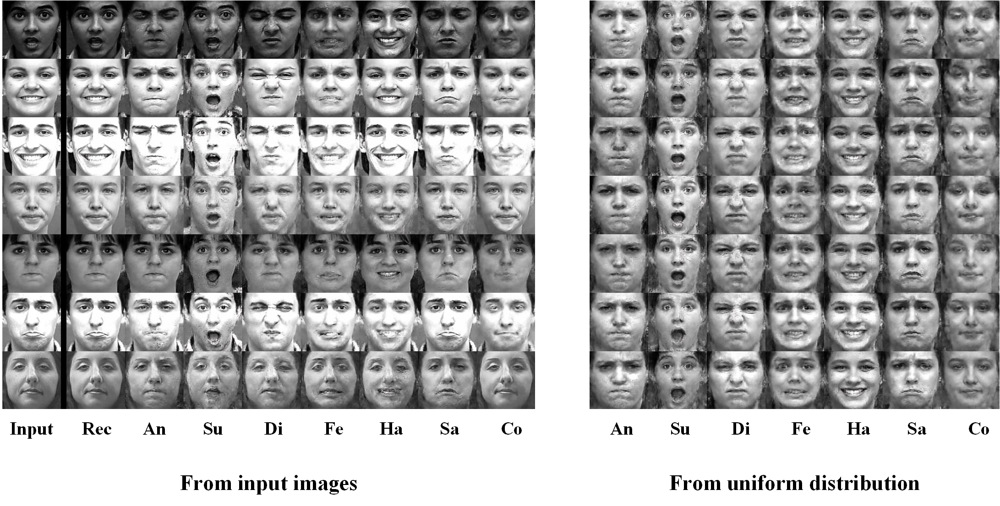

# **Tensorflow** implementation for **Facial Expression Synthesis and Recognition using GAN**

<p align="center">  </p>

- 参考[AttGAN](https://github.com/LynnHo/AttGAN-Tensorflow), 实现人脸表情编辑

- data.py中ImgDataPair类实现pair image + label的读取

- 其他多个模块参考[AttGAN](https://github.com/LynnHo/AttGAN-Tensorflow)

- 使用identity preserve loss需要下载[vgg-face的MatConvNet预训练模型](http://www.vlfeat.org/matconvnet/models/vgg-face.mat)

- data中数据路径格式，参考[Pytorch的DatasetFolder的解析方式](https://github.com/pytorch/vision/blob/master/torchvision/datasets/folder.py)

    ```
    data
    └── CK+
		└── cross_validation1
			├──train  0-6表示类别名
			   ├──0/*.[png,jpg...]
			   ├──1/*.[png,jpg...]
			   ├──2/*.[png,jpg...]
			   ├──3/*.[png,jpg...]
			   ├──4/*.[png,jpg...]
			   ├──5/*.[png,jpg...]
			   └──6/*.[png,jpg...]
			├──test
			└──...
    ```
	
- training

	- for 128x128 images

		```console
		python train.py --img_size 128 --experiment_name ck_cv1_shortcut0_dz_gencfc --epoch 2000
		
- testing

	- test with different expressions
	
		```console
		python test.py --experiment_name ck_cv1_shortcut0_dz_gencfc --n_slide 1
		
	- test with different expressions and intensity control
	
		```console
		python test.py --experiment_name ck_cv1_shortcut0_dz_gencfc --test_int_min -1.0 --test_int_max 1.0 --n_slide 10

- next...
	- models几个网络考虑用什么normalization或者不用？
	- Dz和Dimg两个GAN loss怎么搭配优化？
	- 加入Recognition模块加入